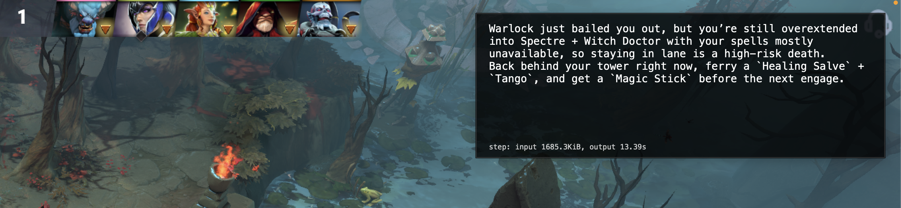

# faeton

faeton is a legendary dota coach.

[](exp/demo.mp4)

## Install

1. Install dependencies:
   - `ffmpeg`
   - `python3`
   - `swift` / `swiftc` (for the HUD overlay)
   - `go` (for the replay decoder, optional)
   - `codex` CLI (required for coaching calls)
   - `BlackHole` (for system audio loopback capture)

```bash
brew install ffmpeg go
brew install blackhole-2ch
python3 -m pip install --user numpy openai-whisper
npm i -g @openai/codex
```

## Run

Start coaching:

```bash
python -m faeton --tag mysession
```

What it does:
- records audio and screen in multiple resolutions
- asks Codex for advice
- puts advice on a HUD
- speaks advice out loud

Game logs are written to:

```text
exp/<timestamp>_<tag>/
```

## Audio notes:

- `faeton` expects a system-audio loopback device and looks for names like:
  - `BlackHole`, `Loopback`, `Soundflower`, `VB-Cable`
- If no loopback device is found, it exits with:
  - `No system-audio loopback device found`
- For best results on macOS, create a Multi-Output/Aggregate setup in Audio MIDI Setup so game audio routes to BlackHole while you can still monitor output.

## Replay Decode

Dump raw replay events with Manta (you need to click "download replay" on the post-game screen):

```bash
./manta_run_decoder <replay.dem>  #  they should be copied from ~/Library/Application Support/Steam/steamapps/common/dota 2 beta/game/dota/replays when you ^C
```

Optional flags:
- `-eclipse`: only ticks where Luna casts Eclipse
- `-include-binary`: include low-level packet families (`CNETMsg_`, `CSVCMsg_`, `CDemo*` etc)

## macOS Distribution (Build + Notarize)

These steps build `Faeton.app` from `hud.swift`, sign it with your Developer ID Application cert, notarize it, staple it, and produce a distributable zip.

Prerequisites:
- Apple Developer Program membership
- `Developer ID Application` identity installed in your keychain
- Xcode command-line tools (`xcrun`, `codesign`, `notarytool`, `stapler`)
- App-specific password for your Apple ID

Check signing identities:

```bash
security find-identity -v -p codesigning
```

You should see something like:
- `Developer ID Application: <Name> (<TEAMID>)`

### 1) Build `Faeton.app` and attach icon

```bash
set -euo pipefail

APP_DIR="builds/Faeton.app"
BIN_DIR="$APP_DIR/Contents/MacOS"
RES_DIR="$APP_DIR/Contents/Resources"
PLIST="$APP_DIR/Contents/Info.plist"
TMP_DIR="/tmp/faeton_icon_work"
ICONSET="$TMP_DIR/faeton.iconset"
BASE_PNG="$TMP_DIR/faeton_base.png"
ICNS="$TMP_DIR/faeton.icns"

rm -rf "$APP_DIR"
mkdir -p "$BIN_DIR" "$RES_DIR" "$ICONSET"

swiftc hud.swift -O -o "$BIN_DIR/Faeton"

cat > "$PLIST" <<'PLIST'
<?xml version="1.0" encoding="UTF-8"?>
<!DOCTYPE plist PUBLIC "-//Apple//DTD PLIST 1.0//EN" "http://www.apple.com/DTDs/PropertyList-1.0.dtd">
<plist version="1.0">
<dict>
  <key>CFBundleDevelopmentRegion</key><string>en</string>
  <key>CFBundleExecutable</key><string>Faeton</string>
  <key>CFBundleIdentifier</key><string>fit.approximate.faeton</string>
  <key>CFBundleInfoDictionaryVersion</key><string>6.0</string>
  <key>CFBundleName</key><string>Faeton</string>
  <key>CFBundlePackageType</key><string>APPL</string>
  <key>CFBundleShortVersionString</key><string>1.0</string>
  <key>CFBundleVersion</key><string>1</string>
  <key>CFBundleIconFile</key><string>faeton.icns</string>
  <key>LSMinimumSystemVersion</key><string>13.0</string>
  <key>NSHighResolutionCapable</key><true/>
  <key>NSPrincipalClass</key><string>NSApplication</string>
</dict>
</plist>
PLIST

# reuse Windows icon asset
sips -s format png windows_hud/faeton.ico --out "$BASE_PNG" >/dev/null
for sz in 16 32 128 256 512; do
  sips -z $sz $sz "$BASE_PNG" --out "$ICONSET/icon_${sz}x${sz}.png" >/dev/null
  sips -z $((sz*2)) $((sz*2)) "$BASE_PNG" --out "$ICONSET/icon_${sz}x${sz}@2x.png" >/dev/null
done
iconutil -c icns "$ICONSET" -o "$ICNS"
cp "$ICNS" "$RES_DIR/faeton.icns"
```

### 2) Sign with Developer ID

```bash
IDENTITY="Developer ID Application: <Name> (<TEAMID>)"
codesign --force --deep --options runtime --sign "$IDENTITY" builds/Faeton.app
codesign --verify --deep --strict builds/Faeton.app
codesign -dv --verbose=2 builds/Faeton.app
```

### 3) Zip for notarization

```bash
ditto -c -k --keepParent builds/Faeton.app builds/Faeton_developerid.app.zip
```

### 4) Configure notarytool credentials (one time)

```bash
xcrun notarytool store-credentials faeton-notary \
  --apple-id "<apple_id>" \
  --team-id "<TEAMID>" \
  --password "<app_specific_password>"
```

### 5) Submit, wait, staple, verify

```bash
xcrun notarytool submit builds/Faeton_developerid.app.zip \
  --keychain-profile faeton-notary \
  --wait

xcrun stapler staple builds/Faeton.app
xcrun stapler validate builds/Faeton.app
spctl -a -vv builds/Faeton.app
```

Expected `spctl` result after success:
- `source=Notarized Developer ID`

### 6) Create final distributable zip

```bash
TS=$(date +%Y%m%d_%H%M%S)
ditto -c -k --keepParent builds/Faeton.app "builds/Faeton_${TS}_developerid_notarized.app.zip"
```
